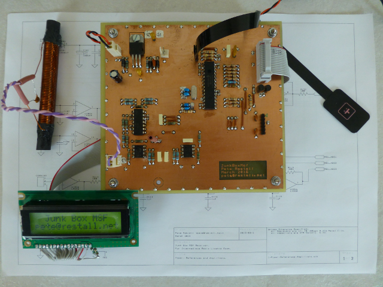

# What is this ?
[JunkBoxMsf](https://github.com/pete-restall/JunkBoxMsf) is an
[MSF](http://www.npl.co.uk/science-technology/time-frequency/products-and-services/time/msf-radio-time-signal)
Radio Receiver / Clock built from parts I've had lying around in my Junk Box
for several years and put together in an extremely short amount of time.  It
is a grossly simple TRF receiver based around Microchip's
[dsPIC30F2010](http://www.microchip.com/wwwproducts/Devices.aspx?product=dsPIC30F2010)
DSC MCU - 4K of program words, 512 bytes of RAM, 30MIPS and a 10-bit ADC.

# Not the Best Parts for the Job...
The project was put together for the practical assessment of my Intermediate
Radio Licence.  I spent six weekends designing and building the hardware and
writing the majority of the firmware for this.  Ordinarily I specify and
order parts as I need them, as well as get PCBs fabricated by a professional
board house, but the turnaround was too tight for this project.  Thus, all
parts are what I had lying around in my Junk Box and not ones I'd have chosen
if I'd done this 'properly'.  The dsPIC30F2010, for example, is a motor
controller from a previous project involving stepper motors, and the PCB is
mainly through-hole and was made at home.  The whole project cost &pound;0.00,
with the membrane switch donated by Dave (thanks !)

# No TDD...?
Since submitting the project for the exam I have spent a further two weeks
adding a menu system, the clock synchronisation logic and generally testing,
tweaking, polishing and turning the device from a demonstration receiver
into a proper clock.  The initial short turnaround has meant that both the
hardware and firmware have been hacked together, thus no TDD :(

# Working Overview
This is mainly a digital project - the analogue portions are nothing more than
op-amps and a power supply.  I even omitted filtering to save time, although
there is a header on the PCB for adding a daughterboard for this purpose.
The simplicity due to the lack of filtering comes at the expense of decreased
SNR and increased aliasing, and I rely on the selectivity of the ferrite rod,
choice of sampling frequency and the fact that the MSF signal in this area is
relatively clean.  All the real magic is DSP.

The 60kHz MSF signal is decoded via an undersampling (80kHz) Goertzel Detector
algorithm, which also synchronises the on-board 32.768kHz crystal with the
MSF minute marker to achieve a time (typically) accurate to within several
tens of milliseconds of UK time.  Periodic resynchronisation is done every
few minutes or few hours (configurable via the menu system) to correct for
the tolerance and potential drift of the local crystal (30ppm) and any
intervening leap seconds that may have occurred.

The current time and date are displayed on the LCD, along with a drift
indicator and any synchronisation information such as ADC channel and whether
the last attempt was successful or not.  There is a single push-button for
menu navigation and turning on the LCD backlight.

The whole thing runs from a (nominal) 12Vdc wall wart and draws about 90mA when
receiving, 15mA in normal operation, and 11.5mA if the LCD is also turned
off.  This equates to about 140-180mW at 12V, plus wall wart losses - there
was no provision (or thought) about turning off the analogue receiver to
reduce consumption further.  The parts in my Junk Box are typically old DIPs
and not for low power operation.  The backlight on my LCD draws about 120mA.
